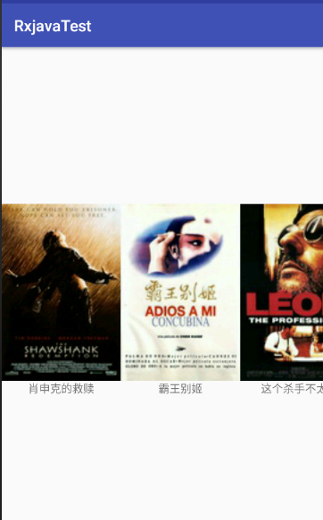
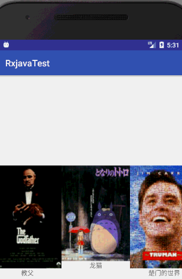

# Rxjava2使用之结合Retrofit

## 概念


> RxJava – Reactive Extensions for the JVM – a library for composing asynchronous and event-based programs using observable sequences for the Java VM.
>
> 一个在 Java VM 上使用可观测的序列来组成异步的、基于事件的程序的库。

本Demo可以让你更快更有套路使用Rxjava2和Retrofit的混用，上个图吧`:happy:`

 

##### 其实没什么特效，就是简单利用它们结合来请求豆瓣数据并显示到RecycleView上

**步骤一**

* 创建MovieRetrofit类,使用单例模式获取实例

  ```
  public static MovieRetrofit getInstance(){
          if (sMovieRetrofit==null){
              synchronized (MovieRetrofit.class) {
                  if (sMovieRetrofit == null) {
                      sMovieRetrofit = new MovieRetrofit();
                  }
              }
          }
          return sMovieRetrofit;
      }
  ```


* 在MovieRetrofit构造方法里创建Retrofit对象

  ```
  Retrofit retrofit = new Retrofit.Builder()
     .baseUrl("https://api.douban.com/v2/movie/")
     .addConverterFactory(GsonConverterFactory.create())
     //切记使用Rxjava2得加上这一行代码
     .addCallAdapterFactory(RxJava2CallAdapterFactory.create())
     .build();
    
  ```

**步骤二**

* 定义接口MovieService，这里的请求url的根目录为top250

  > 引用api：https://api.douban.com/v2/movie/top250?start=0&count=20

  ```
  public interface MovieService {
   	@GET("top250")
   //一般使用Retrofit为Call<ResponseInfo>,而这里将使用Rxjava2
  Observable<ResponseInfo> getMovieList(@Query("start")int start, @Query("count") int count);
  }
  ```

  注意，这里是`interface`不是`class`，所以我们是无法直接调用该方法，我们需要用Retrofit创建一个`MovieService`的代理对象。

  ```
  mMovieService = retrofit.create(MovieService.class);
  ```

  ```
    //mMovieService为请求接口需要提供出去
   public MovieService getMovieService() {
          return mMovieService;
      }
  ```

**步骤三**

* 在MovieActivity里进行接口调用

         //0代表从第0条开始，20表示一次请求取20条，具体看获得请求数据url
         //通过单例模式获得请求接口
      Observable<ResponseInfo> movieCall = MovieRetrofit.getInstance().getMovieService().getMovieList(0, 20);
      	//放送请求
          movieCall.subscribeOn(Schedulers.io())
          		//map()方法作用:类型转化 ResponseInfo--》List<ResponseInfo.SubjectsBean>
                  .map(new Function<ResponseInfo, List<ResponseInfo.SubjectsBean>>() {
                      @Override
                      public List<ResponseInfo.SubjectsBean> apply(ResponseInfo 		     responseInfo) throws Exception {
                          for(int i=0;i<20;i++){
                              mMovieList.add(responseInfo.getSubjects().get(i));
                          }
                          return mMovieList;
                      }
                  })
                  //此方法是让下面onNext在主线程消费事件
                  .observeOn(AndroidSchedulers.mainThread())  
                  .subscribe(new Observer<List<ResponseInfo.SubjectsBean>>() {
                      //当Observable调用subscribe方法时会回调该方法（运行在主线程）
                      @Override
                      public void onSubscribe(Disposable d) {
                          //设置recycleview的方向（水平方向）
                          mRvMovie.setLayoutManager(new LinearLayoutManager(mContext,
                                  LinearLayoutManager.HORIZONTAL,false));
                      }
                      //onSubscribe方法后调用，此方法是接收上面map()返回的数据对象
                      @Override
                      public void onNext(List<ResponseInfo.SubjectsBean> data) {
                          mAdapter = new MovieRvAdapter(mContext,data);
                          mRvMovie.setAdapter(mAdapter); //设置recycleview适配器
      
                      }
      
                      @Override
                      public void onError(Throwable e) {
      
                      }
      
                      @Override
                      public void onComplete() {
      
                      }
                  });
      }

**步骤四**

* 创建MovieRvAdapter继承RecyclerView.Adapter
* 将请求数据与RecyclerView绑定，最终效果告成

 
